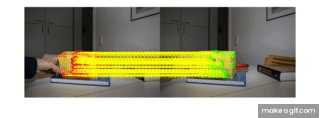

# Pose Estimation in Matlab

If you want to run this code, you need to install the vl_sift function along with the vl_ubcmatch function.
[Therefore follow this link.](http://www.vlfeat.org)
After that run the following code in the MATLAB terminal:
run('path\to...\vlfeat-0.9.21\toolbox\vl_setup.m')

In this repository, the Pose Estimations of the camera is calculated, as well of the teabox object in the picture. 

The first exercise covers the various Camera Poses and displays them on the image. So where the camera is located in the world frame.

Format: 

The Second Exercise covers the SIFT keypoints to infer the object pose to various other images using PnP and RANSAC
Format: 
Format: 

The thrid exercise dealt with the combination of the 2 previous exercises and displays the camera trajectory on all the images. Therefore the first image was used to estimate its pose along with the world coordinates. The consecutive frames were matched with the SIFT keypoints to infer the camera pose on each frame.
Format: 